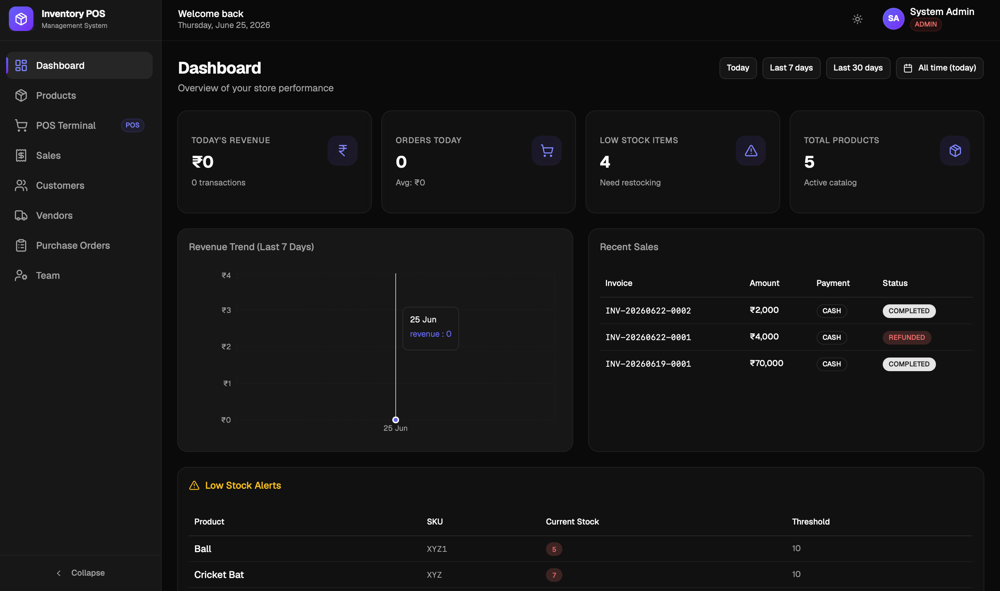
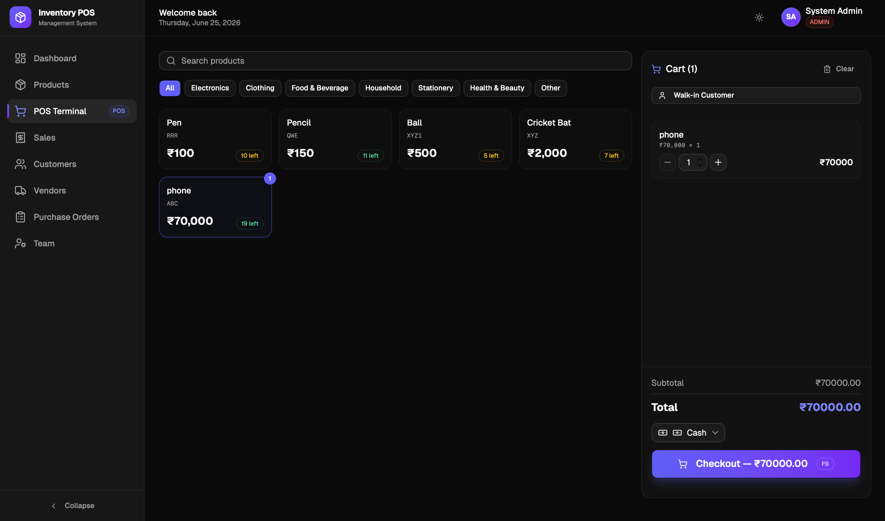

# 🧾 Inventory & POS System

A full-stack Point-of-Sale and inventory management system built with the MERN stack. Supports multi-role access control, secure JWT authentication, and an analytics dashboard with date-range filtering.

🔗 **Live Demo:** [https://business-project-livid.vercel.app](https://business-project-livid.vercel.app) &nbsp;|&nbsp; **Backend:** [https://business-project-m2ir.onrender.com](https://business-project-m2ir.onrender.com)



---

## ✨ Features

- **Role-Based Access Control** — 3 authorization levels (Admin, Manager, Cashier) enforced at both route and UI level
- **JWT Dual-Token Auth** — access + refresh token rotation with bcrypt password hashing and rate limiting (5 req / 15 min)
- **Analytics Dashboard** — date-range filtering, daily revenue breakdowns, top-selling products, payment method breakdown
- **Low Stock Alerts** — real-time inventory warnings when stock drops below configurable thresholds
- **POS Terminal** — fast checkout interface with product search, cart management, and invoice generation
- **User Management** — Admins can provision, update roles, and deactivate team members without database access
- **Audit-Ready Logging** — Winston request logging and Helmet HTTP header security in production

---

## 🛠 Tech Stack

| Layer | Technologies |
|-------|-------------|
| **Frontend** | React 18, TypeScript, TanStack Query, Recharts, shadcn/ui, Tailwind CSS |
| **Backend** | Node.js, Express, MongoDB, Mongoose |
| **Auth** | JWT (access + refresh tokens), bcrypt, custom rate limiter |
| **Validation** | Zod schema validation on all 46 API endpoints |
| **Logging** | Winston, Morgan |
| **Security** | Helmet, CORS, express-rate-limit |
| **Deployment** | Vercel (frontend), Render (backend), MongoDB Atlas |

---

## 🚀 Getting Started

### Prerequisites

- Node.js 18+
- MongoDB Atlas account (or local MongoDB)
- Git

### Installation

```bash
# 1. Clone the repository
git clone https://github.com/RaghavS-45/Business-Project
cd Business-Project

# 2. Install backend dependencies
cd backend
npm install

# 3. Install frontend dependencies
cd ../frontend
npm install
```

### Environment Variables

Create a `.env` file in the `backend/` directory:

```env
# Server
PORT=5001
NODE_ENV=development

# MongoDB
MONGODB_URI=mongodb+srv://<user>:<password>@cluster.mongodb.net/inventory-pos

# JWT
JWT_ACCESS_SECRET=your_access_secret_here
JWT_REFRESH_SECRET=your_refresh_secret_here
JWT_ACCESS_EXPIRES_IN=15m
JWT_REFRESH_EXPIRES_IN=7d

# Logging
LOG_LEVEL=info
```

Create a `.env` file in the `frontend/` directory:

```env
VITE_API_URL=http://localhost:5001/api
```

### Running Locally

```bash
# Start backend (from /backend)
npm run dev

# Start frontend (from /frontend)
npm run dev
```

Frontend runs on `http://localhost:5173`, backend on `http://localhost:5001`.

### Seed an Admin User

Use Postman or Thunder Client to create your first admin:

```
POST http://localhost:5001/api/auth/register
Content-Type: application/json

{
  "name": "Admin User",
  "email": "admin@example.com",
  "password": "yourpassword",
  "role": "ADMIN"
}
```

> After the first admin is created, the register endpoint requires an Admin JWT token to create further users.

---

## 📡 API Overview

**46 REST endpoints** across 6 modules:

| Module | Endpoints | Access |
|--------|-----------|--------|
| Auth | register, login, refresh, logout, logout-all, me | Public / Authenticated |
| Products | CRUD, pagination, low-stock filter | Admin, Manager |
| Sales | checkout, list, summary, daily analytics | Admin, Manager, Cashier |
| Customers | CRUD, search | All roles |
| Vendors | CRUD | Admin, Manager |
| Users | list, create, update role, deactivate | Admin only |

---

## 🔐 Role Permissions

| Feature | Admin | Manager | Cashier |
|---------|-------|---------|---------|
| Dashboard & Analytics | ✅ | ✅ | ❌ |
| Products (CRUD) | ✅ | ✅ | ❌ |
| POS Terminal | ✅ | ✅ | ✅ |
| Sales History | ✅ | ✅ | ❌ |
| Customers | ✅ | ✅ | ✅ |
| Vendors | ✅ | ✅ | ❌ |
| User Management | ✅ | ❌ | ❌ |

---

## 📸 Screenshots

| Dashboard | POS Terminal |
|-----------|-------------|-----------------|
|  |  

---

## 🏗 Project Structure

```
inventory-pos/
├── backend/
│   ├── src/
│   │   ├── config/          # env, logger, db
│   │   ├── controllers/     # thin HTTP layer
│   │   ├── services/        # business logic
│   │   ├── models/          # Mongoose schemas
│   │   ├── routes/          # Express routers
│   │   ├── middleware/       # auth, validate, error handler
│   │   ├── validators/      # Zod schemas
│   │   └── utils/           # ApiError, tokens
│   └── server.js
└── frontend/
    └── src/
        ├── components/      # UI components
        ├── pages/           # Route-level pages
        ├── hooks/           # TanStack Query hooks
        ├── stores/          # Zustand auth store
        └── lib/             # axios instance, utils
```

---

## 📄 License

MIT © [Raghav Sawhney](https://github.com/RaghavS-45) & [Shrestha Das](https://github.com/shresthadas09)
